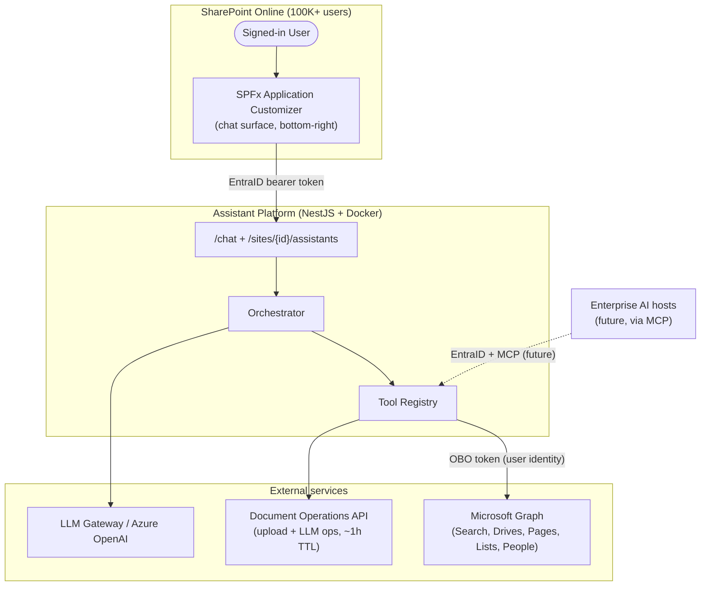
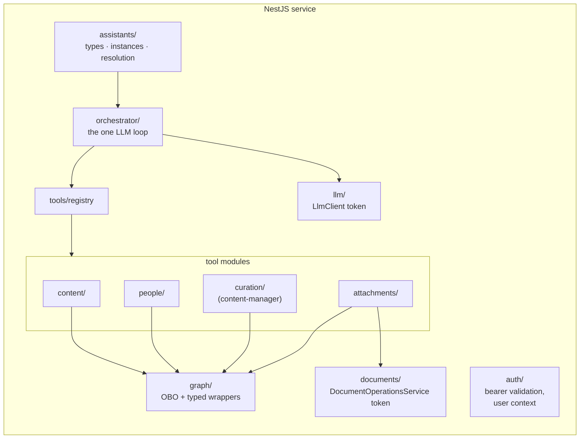
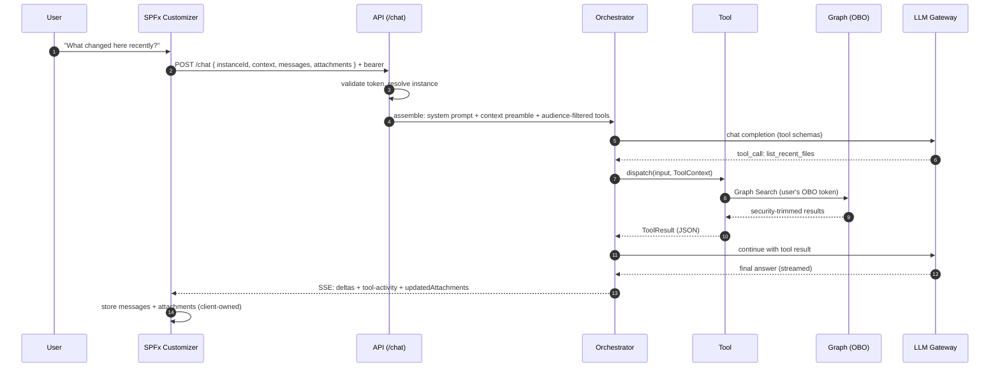

# SharePoint AI Assistant Platform — Architecture Overview

> **Read this first.** This document describes the system's shape and the reasoning behind it.
> For *why* individual decisions were made, see [02-decision-log.md](./02-decision-log.md).
> For interface details, see [03-contracts.md](./03-contracts.md).
> For how to add capabilities, see [04-extending-the-platform.md](./04-extending-the-platform.md).

## 1. What this is

A context-aware AI assistant platform for SharePoint Online, surfaced via an SPFx
Application Customizer anchored to the bottom-right of every page (inspired by
SharePoint's Knowledge Agent). A **Site Assistant** is the default experience;
sites may register other assistants (People Finder, Expertise Finder), and a
**Search Assistant** surfaces only on search results pages.

The platform thesis: **assistants are configuration, tools are code.** New
assistants should rarely require new orchestration — only new tools, prompts,
and instance registrations.

## 2. Core principles

| Principle | Consequence |
|---|---|
| **Delegated auth end-to-end (OBO)** | Every Graph/Search call runs as the signed-in user. Security trimming is inherited; no permission logic in our code. |
| **Client classifies, server resolves** | SPFx describes page context; the backend decides which assistants apply. New rules ship without SPFx redeployment. |
| **Ephemeral, client-owned conversation state** | Chat history + attachments ride in each request. Backend is stateless and horizontally scalable. Persistence can be added later behind the same contract. |
| **One orchestrator, tools as the extension point** | A single LLM loop serves every assistant type. Capabilities live in typed tools; complexity hides *inside* tools, never in the loop. |
| **Environment seams behind injection tokens** | `LlmClient` (Azure OpenAI ↔ enterprise gateway) and `DocumentOperationsService` (reference impl ↔ real document API) are the only environment-specific components. |
| **Transport-agnostic capabilities** | Tools serve both the chat orchestrator and (later) an MCP shim for enterprise AI hosts. The chat endpoint is an adapter, not the product. |

## 3. System context



Auth chain: SPFx acquires a token for the API via `AadHttpClient`
([enterprise API pattern](https://learn.microsoft.com/en-us/sharepoint/dev/spfx/use-aadhttpclient-enterpriseapi));
the API exchanges it via OBO for Graph. **The user's identity flows to every data access.**

## 4. Backend component map



Directory layout:

```
src/
├── assistants/
│   ├── assistant-types/     # code-defined: { typeId, systemPrompt, model, toolIds[], defaultConfig }
│   ├── instances/           # instance store (config file → DB later, behind a token)
│   └── resolution/          # context → applicable instances + default (rules-as-data)
├── orchestrator/            # prompt assembly → LLM w/ tool schemas → dispatch → stream
├── tools/
│   ├── registry/
│   ├── content/             # search_content, list_recent_files, list_recent_pages, get_page
│   ├── people/              # find_person, find_by_expertise
│   ├── attachments/         # attach_item, summarize_attachment, answer_from_attachments
│   └── curation/            # find_stale_content, archive_item
├── graph/
├── llm/
├── documents/
└── auth/
```

## 5. Key concepts

### Assistant type vs. instance vs. resolution
- **Type** (code): a capability implementation — prompt template, model alias, tool set. E.g. `site-assistant`, `people-finder`, `search-assistant`, `library-assistant`.
- **Instance** (data): a configured registration of a type on a site, with `config` (e.g. `sourceScope.listId`), `surfaceRules` (where it appears), and default flag.
- **Resolution** (server logic over data): given `{ siteId, pageType, listId?, ... }`, return applicable instances + the default. No context → site defaults.

**Scope of content ≠ scope of surface.** An instance may *source* from Library X
(`config.sourceScope`) while *appearing* on the site home page (`surfaceRules.pageTypes`).
These are independent fields by design.

### Tools
The unit of capability and reuse. A tool declares a JSON schema (what the LLM
sees), an optional `audience` (`viewer` | `contentManager`), and an `execute`
function receiving a `ToolContext` (user, OBO token, site context, attachments,
instance config). The Search Assistant reuses content, people, and attachment
tools built for other assistants — that reuse is the design working as intended.

### Attachments
Client-held grounding references: `{ driveId, itemId, documentProcessingId, filename }`.
`attach_item` fetches content via Graph (OBO — access checked at attach time) and
uploads it to the Document Operations API; subsequent summarize/answer operations
reference `documentProcessingId`. The document API owns TTL/cleanup (~1 hour,
extendable). Expired handles are self-healing: `{ driveId, itemId }` allows silent
re-upload. Small structured data (list fields, metadata, file listings) skips the
document service entirely and returns as JSON tool results.

## 6. Chat request flow



## 7. SPFx composition

```
ApplicationCustomizer (tenant-wide deployed)
├── PageContextClassifier   # THE client-side logic module: URL/PageContext → normalized context
│                           # (isolated on purpose — SPO page-detection quirks concentrate here)
├── AssistantService        # /sites/{id}/assistants + /chat calls
├── ChatStateStore          # messages + attachments, in-memory (sessionStorage revival = v1.1)
└── UI
    ├── <Launcher/>         # bottom-right floating button
    └── <ChatSurface/>      # anchored floating card — NOT a <Panel>; non-blocking,
                            # user keeps interacting with the page (Knowledge Agent pattern)
```

Client responsibilities are deliberately minimal: classify context, call resolve,
render what the server says, hold conversation state. Every behavioral rule is
server-side data. Navigation tears down the chat in v1 (accepted; transcript is
client-owned, so sessionStorage revival is a cheap later enhancement). Modern SPO
partial navigations must be handled deliberately (refresh context or reset).

## 8. Scale posture (100K users)

- Stateless `/chat` nodes → horizontal scaling, no session affinity.
- LLM capacity, throttling, and model routing are owned by the enterprise LLM
  gateway (environment seam #1); the reference build targets Azure OpenAI directly.
- View/staleness data comes from search managed properties
  (`ViewsLast1Days` … `ViewsLifeTime`) — security-trimmed, no reports API.
  *Caveat:* index-fed, eventually consistent; set UX expectations accordingly.
- Backpressure: gateway 429s surface as retry-with-jitter or a "busy" chat state
  (contract details with the gateway team — see build plan, Phase 5).

## 9. What this design explicitly defers

- Server-persisted conversations (audit/resume) — addable behind the existing `/chat` contract.
- Self-service assistant authoring — a new authoring path writing instance records; no architecture change.
- MCP exposure — a shim module over the existing tool registry + instance store.
- Search Assistant "refine" mechanics (mutate the OOB search page vs. in-chat searches) — product decision, Phase 4.
