# Build Plan

Sequenced so each phase retires the biggest remaining risk. Durations are
rough-order estimates for a small team; parallelization noted where safe.

`[x]` = done, `[ ]` = not started. Update in the same PR as the work.

```mermaid
gantt
    dateFormat  X
    axisFormat  %s
    section Foundation
    P0 Walking skeleton (auth plumbing)     :p0, 0, 2
    P1 One tool end-to-end (streaming)      :p1, after p0, 2
    section Product
    P2 Site Assistant (viewer)              :p2, after p1, 3
    P3 Attachments + document ops           :p3, after p2, 2
    P4 Breadth (parallel tracks)            :p4, after p3, 3
    section Scale
    P5 Hardening for 100K                   :p5, after p4, 3
    section Parallel
    MCP shim (any time after P1)            :mcp, after p1, 4
```

---

## Phase 0 — Walking skeleton *(~1–2 wks)*

**Retires:** auth/tenant plumbing risk — the pure-toil work that blocks everything.

- [x] `spo-assistants-api` repo scaffolded per ADR-009 (incl. `/docs` — this set):
  `.nvmrc` + lockfile, NestJS CLI baseline, strict TypeScript, ESLint + Prettier.
- [ ] CI pipeline for `spo-assistants-api`.
- [ ] `spo-assistants-spfx` repo: [`spo-assistants-spfx`](https://github.com/brianpmccullough/spo-assistants-spfx)
  scaffolding, own `.nvmrc` + lockfile + CI; defines its own model copies per doc 03.
- [ ] EntraID app registrations: API app + SPFx consumer; `webApiPermissionRequests`
  in the SPFx package; admin consent flow exercised.
- [x] Bearer validation guard + user context extraction (`auth/`), `GraphClient`
  OBO exchange (`graph/`), `/me` endpoint returning the user's identity from Graph.
  Still needed: containerize in Docker.
- [ ] Bare Application Customizer, tenant-deployed to a dev tenant: bottom-right
  launcher that calls `/me` via `AadHttpClient` and displays the result.
- [x] CORS (`CORS_ALLOWED_ORIGINS` env var, defaults to the local SPFx dev server).
- [x] Environment config skeleton: `ConfigurationService` (typed `settings`/`secrets`
  facade over `@nestjs/config`), env vars validated at boot via `class-validator`/
  `class-transformer` (fails fast on invalid config).
- [ ] CI pipeline stub.

**Exit:** a button on a real SPO page proves the full identity chain
SPFx → API → OBO → Graph.

## Phase 1 — One tool, end to end *(~1–2 wks)*

**Retires:** streaming-through-infrastructure risk; validates the tool contract
with working code. Everything after this phase is repetition of a proven shape.

- [ ] `ToolRegistry` + `Tool`/`ToolContext` interfaces (per [03-contracts.md §5](./03-contracts.md)).
- [ ] `GraphClient` (OBO + first typed wrappers) and `list_recent_files` tool.
- [ ] Minimal orchestrator: real LLM loop (prompt → tool schemas → dispatch → continue), one tool.
- [ ] `LlmClient` token + Azure OpenAI implementation.
- [ ] `/chat` SSE endpoint; chat surface rendering deltas + tool-activity events.
- [ ] **Spike within this phase:** `AadHttpClient` vs. raw `fetch` + manually acquired
  token for SSE consumption (AadHttpClient does not expose response streams cleanly).
  Decision recorded as a note on ADR-008 or a new ADR.

**Exit:** "what are the recent files here?" answered with streamed, grounded,
security-trimmed results on a real page.

## Phase 2 — Site Assistant, viewer capabilities *(~2–3 wks)*

**Retires:** resolution model + context classification risk. First ship-able preview.

- [ ] Instance store (config-file impl behind store token) + resolution endpoint
  (`GET /sites/{id}/assistants` with context params; no-context → defaults).
- [ ] `PageContextClassifier` with tests against real modern/classic pages, library
  views, site contents, search page variants (incl. PnP Modern Search if in scope).
- [ ] Content tools: `list_recent_pages`, `search_content`, `get_page`.
- [ ] Context preamble in prompt assembly ("user is viewing page X on site Y").
- [ ] Chat UX pass: floating card polish, tool-activity display, error states.
- [ ] History window trimming + initial token budgets (tune here).

**Exit:** internal preview cohort using the Site Assistant on pilot sites.
Contract shapes in doc 03 promoted from "directional" to settled.

## Phase 3 — Attachments + document operations *(~2 wks)*

**Retires:** grounding/token-budget risk.

- [ ] `DocumentOperationsService` token + reference implementation (blob/in-memory + `LlmClient`).
- [ ] Tools: `attach_item` (Graph fetch → upload → handle), `summarize_attachment`,
  `answer_from_attachments`; expired-handle re-upload path.
- [ ] SSE `attachments` event + client chips UI + echo-back protocol; detach.
- [ ] Verify against the real Document Operations API contract (size limit ~10 MB,
  TTL/extension) even if integration lands later.

**Exit:** attach a document from chat, ask questions grounded in it, watch the
handle survive (or transparently recover from) expiry.

## Phase 4 — Breadth *(~2–3 wks, three parallelizable tracks)*

The phase that *tests the architecture*: each track should be mostly tools +
prompts + instances. If any track demands orchestrator changes, stop and ADR it.

- [ ] **Track A — Content manager:** `find_stale_content` (search managed view
  properties), `archive_item`; audience filtering wired to real permission
  resolution (Graph, briefly cached).
- [ ] **Track B — People:** `find_person`, `find_by_expertise`; `people-finder` and
  `expertise-finder` types; default instances on their sites.
- [ ] **Track C — Search Assistant:** `searchResults` classification (incl.
  `searchQuery` extraction), `refine_search` tool, type + instance with
  `surfaceRules.pageTypes: ['searchResults']`.
  **Product decision due here:** refine = in-chat searches vs. mutating the OOB
  results page. Recommend starting in-chat (no coupling to OOB page internals).

**Exit:** all four launch assistants live on pilot sites; the §6 worked-example
table in [04-extending-the-platform.md](./04-extending-the-platform.md) validated in practice.

## Phase 5 — Hardening for 100K *(~2–3 wks + ongoing)*

- [ ] Gateway integration: swap `LlmClient` to the enterprise gateway; confirm
  streaming passthrough + 429/backpressure semantics; retry-with-jitter and
  "busy" chat states.
- [ ] Real Document Operations API adapter behind its token.
- [ ] Rate limiting at our API tier; per-user fairness.
- [ ] Telemetry: tool-call latency, token usage per assistant type, resolution cache
  hit rates, error taxonomies. (App Insights or platform standard.)
- [ ] Tenant-wide deployment mechanics; bundle caching/versioning strategy; version-skew
  safety (unknown pageTypes degrade gracefully — verify).
- [ ] Corner-chrome coexistence audit (SPO Copilot/feedback buttons) across page types.
- [ ] Load test the stateless tier; capacity model documented (LLM gateway owns the
  hard ceiling — confirm ours isn't accidentally lower).

## Parallel track — MCP shim *(any time after Phase 1)*

- [ ] Prereq conversation with the enterprise AI host team: can the host acquire an
  EntraID token for our API (delegated chain preserved)? **Do this early — it's
  a dependency on another team, not on our code.**
- [ ] Shim module: registry → MCP tool definitions, per-instance namespaces, dispatch.
- [ ] Pilot with one instance (e.g. Expertise Finder — small tool surface).

---

## Standing risks & watch items

| Risk | Mitigation | Phase |
|---|---|---|
| SSE through SPO/proxy/gateway infra | Spike early | P1 |
| `AadHttpClient` streaming limitations | fetch + manual token fallback | P1 |
| Search managed view properties: index lag, property availability in tenant | Verify against real tenant; set UX expectations | P2/P4-A |
| Enterprise host EntraID token acquisition (MCP) | Early cross-team conversation | Parallel |
| Corner UI collisions with SPO chrome | Isolated in launcher component; audit | P2, P5 |
| Token budget blowouts on large attachments | Document service owns heavy ops; boundary rule enforced | P3 |
| Gateway 429 semantics unknown | Contract conversation; retryable error UX | P5 |
